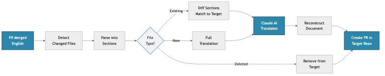

<!-- _class: lead -->

# action-translation

**AI-Powered Translation Automation for Lectures**

GitHub Action + `translate` CLI • Claude Sonnet 5 • MyST Markdown

_QuantEcon Project_

---

# What It Does

**Automatically translates and reviews lectures when source content changes**

Monitor merged PRs → Detect changes → Translate → Create PR → AI Review → Route

## Key Capabilities

✓ **Smart Diff Translation** – Only translates modified sections
✓ **MyST Markdown Aware** – Preserves code, math, directives, anchors
✓ **Consistent Terminology** – Per-language glossaries (330–370 terms each)
✓ **Machine-Readable Review** – Verdict block with scores + auto-merge/editor routing
✓ **Deterministic Guardrails** – Structural parity, typography, bibliography backfill
✓ **Language Extensible** – zh-cn, fa, fr, ml, ja, es configured

---

# How It Works

## Section-Based Translation Approach

### ❌ Problem: Block-Level

- Can't match across languages
- Loses translation context
- Complex mapping logic

### ✅ Solution: Section-Based

- Match by heading-map, then position
- Translate full sections
- Simple: Add, Update, Delete

Heading maps live in each translated file's frontmatter — English heading text mapped to its translation, so sections stay matched even after edits and reorders.

---

# Translation Workflow

---

# LLM-Powered Translation (Claude Sonnet 5)

### UPDATE Mode
_(changed sections)_

- Sends: old EN + new EN + current translation
- Claude sees what changed
- Preserves style, terminology, and target-side localisation
- Glossary pins technical terms

### NEW / RESYNC Modes
_(new files, drift recovery)_

- Whole-document translation with full context
- Deterministic post-pass: typography, heading map, frontmatter carry-forward
- Structural parity guard refuses corrupted output

---

# Three Operational Modes

### 🔄 Sync Mode _(source repo)_

- Fires on merged PRs
- Translates changed sections
- Backfills cited `.bib` entries
- One PR per target language

### 🔀 Rebase Mode _(target repo)_

- Keeps sibling translation PRs current during waves

### 📝 Review Mode _(target repo)_

- Scores accuracy, fluency, terminology, formatting
- Deterministic diff checks (structure, heading map)
- Emits a machine-readable verdict block
- Routes: `auto-merge` vs `editor`
- Shadow mode records would-auto-merge without acting

---

# The `translate` CLI

**Operator tooling for everything the Action can't reach from CI**

| Command | Purpose |
|---|---|
| `init` | Bulk-seed a new edition from the source repo |
| `status` | Per-file sync state (`--check-sync` for content drift) |
| `forward` | Resync drifted files, one PR each (`--github`) |
| `backward` | Capture target-side improvements upstream |
| `review` | Local review of a translation PR |
| `setup` / `doctor` | Scaffold and verify workflow wiring |

---

# Trust & Safety

✓ **Trust-gated triggers** – resync commands require OWNER/MEMBER/COLLABORATOR
✓ **Fail-closed parsing** – malformed model output fails the run, never fabricates a verdict
✓ **Verdict provenance** – engine version + reviewed SHA in every verdict block
✓ **Append-only bibliography** – localised entries are never overwritten
✓ **Loud failure** – partial runs open issues; silent-success paths are being closed (W1)

---

# Status & Getting Started

## Current Status

📦 **v0.25.0** – deployed estate-wide
🔄 **Three modes**: Sync + Review + Rebase
✅ 1,500+ tests, type-checked, zero skips
🧪 27 E2E scenarios × 3 languages on real repos

## In Production

- lecture-python.zh-cn
- lecture-python-programming (zh-cn / fa / fr)

## Resources

**GitHub**: QuantEcon/action-translation

**Docs**: `docs/user/` (quickstart, tutorials, metadata contract)

**License**: MIT

